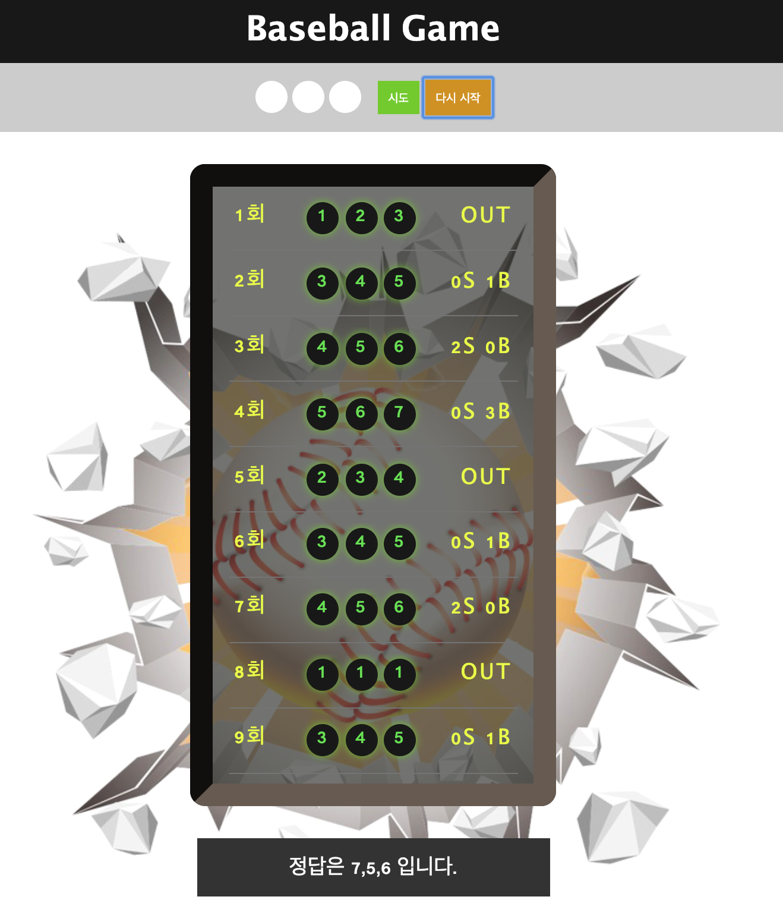

# FDS 9기 해커톤 템플릿 프로젝트 (FastMonkeys)

이 프로젝트는 해커톤에서 템플릿으로 사용할 수 있는 프로젝트입니다. 빌드 도구로 [Parcel](https://parceljs.org/)을 사용하고 있으며, [create-react-app](https://github.com/facebook/create-react-app)에서 사용하는 [Babel](http://babeljs.io/) 프리셋인 [babel-preset-react-app](https://github.com/facebook/create-react-app/tree/master/packages/babel-preset-react-app)을 통해 여러 최신 문법을 사용할 수 있도록 설정되어 있습니다.

## 팀원 (ㄱㄴㄷ 순서대로)

- 김동원
- 손승현
- 정재한

## 해커톤 주제

숫자야구

## 해커톤 채점 기준

- **버그**가 없는지
- 코드가 얼마나 **깔끔**한지 (코드 중복은 없는지, 파일이 잘 나뉘어져 있는지, 코드가 읽기 쉬운지...)
- **도움말**이 얼마나 친절한지
- **눈을 사로잡는 부분**이 있는지 (애니메이션!)
- **팀원 간 기여도**가 얼마나 비슷한지
- Git **커밋 메시지**가 얼마나 깔끔한지

## 추가 과제

SOUNDJS 를 이용하여 효과음을 넣고 싶습니다 (out, strike 사운드를 찾지 못하였습니다 ㅠㅠ)

## 게임하기

[야구게임](https://fastmonkeysbaseballgame.netlify.com)

